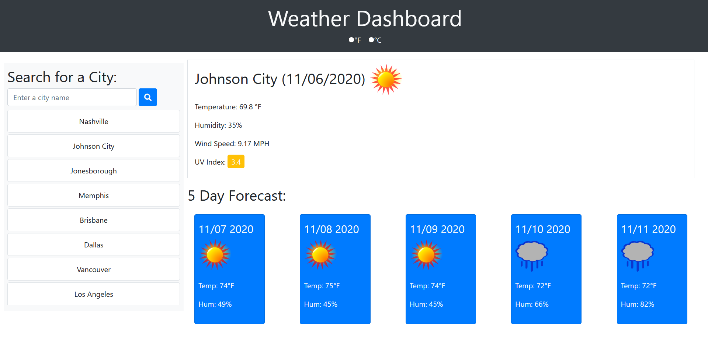
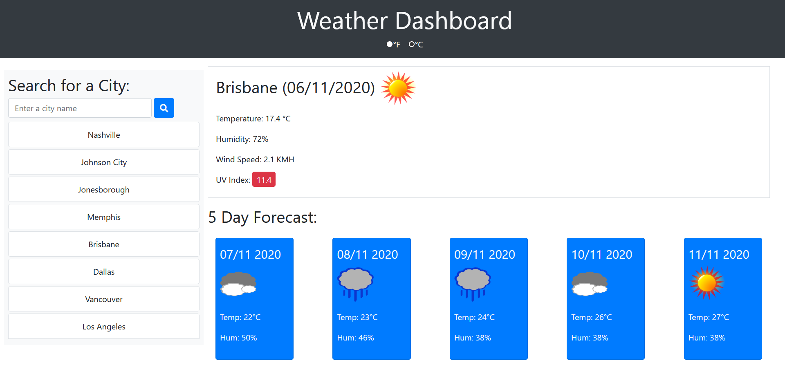

# weather-dashboard

## Purpose
A simple weather app to get your current weather and five day forecast for the city of your choosing.
### Table of Contents
- [Website](#website)
- [Built With](#built-with)
- [Resources](#resources)
- [Contribution](#contribution)
    - [Author Contact Info](#author-contact-info)
- [Features](#features)

---

## Website
 https://craig5117.github.io/weather-dashboard/

[Back to Contents](#table-of-contents)

---

## Built With
- HTML
- CSS
- Javascript
- [JQuery](https://jquery.com/) (https://cdnjs.cloudflare.com/ajax/libs/jquery/3.5.1/jquery.min.js)
- [Bootstrap](https://getbootstrap.com/) (https://cdn.jsdelivr.net/npm/bootstrap@4.5.3/dist/css/bootstrap.min.css)
- [Moment.js](https://momentjs.com/) (https://cdnjs.cloudflare.com/ajax/libs/moment.js/2.24.0/moment.min.js)

[Back to Contents](#table-of-contents)

---
## Resources
- [Font Awesome](https://fontawesome.com/) (https://cdnjs.cloudflare.com/ajax/libs/font-awesome/5.15.1/css/all.min.css)
- [OpenWeather](https://openweathermap.org/)

[Back to Contents](#table-of-contents)

---
## Features
- Search weather by city for as many as 200,000 cities worldwide.
- Easily toggle between metric and imperial (US) measurements.
- Displays current weather and a five day forecast.
- Up to eight of the most recent search entries are saved, and stored below the search bar for user convenience.
- UV Index is color coded by intensity level. Green indicates favorable, yellow indicates moderate, and red indicates severe.
- General weather condition is indicated by a colorful icon.

---

## Contribution

**Craig Bennett**

### Author Contact Info:

GitHub: https://github.com/Craig5117

LinkedIn: https://www.linkedin.com/in/craig-bennett-852a571b4/

[Back to Contents](#table-of-contents)

